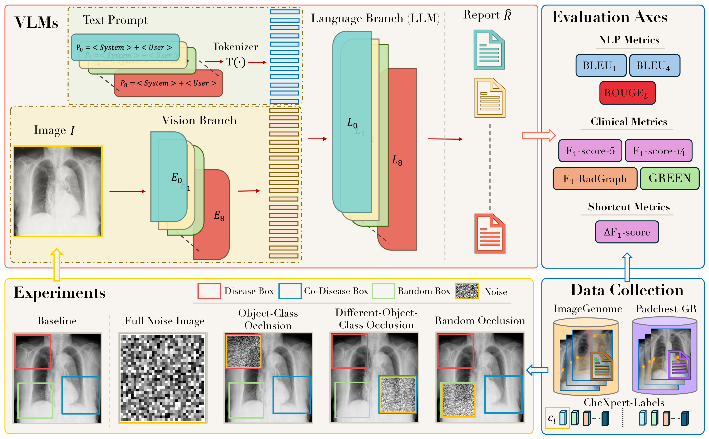
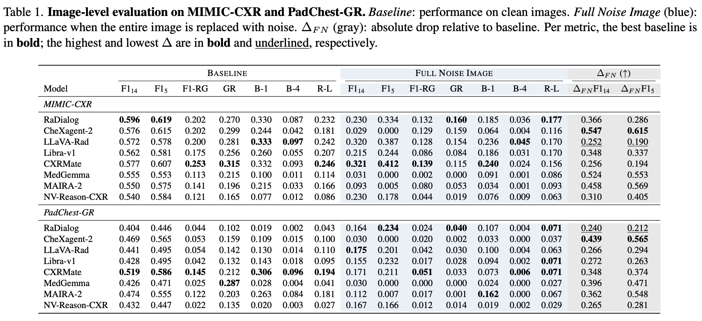
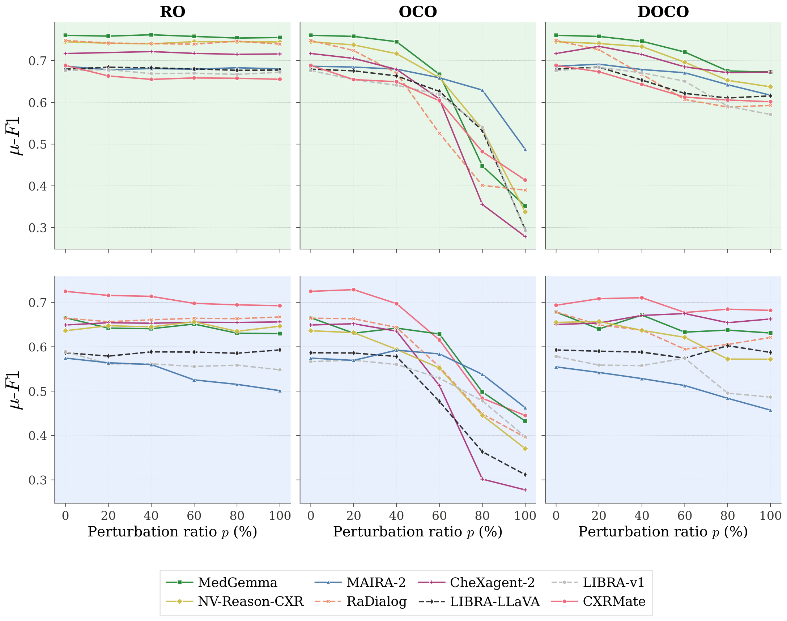
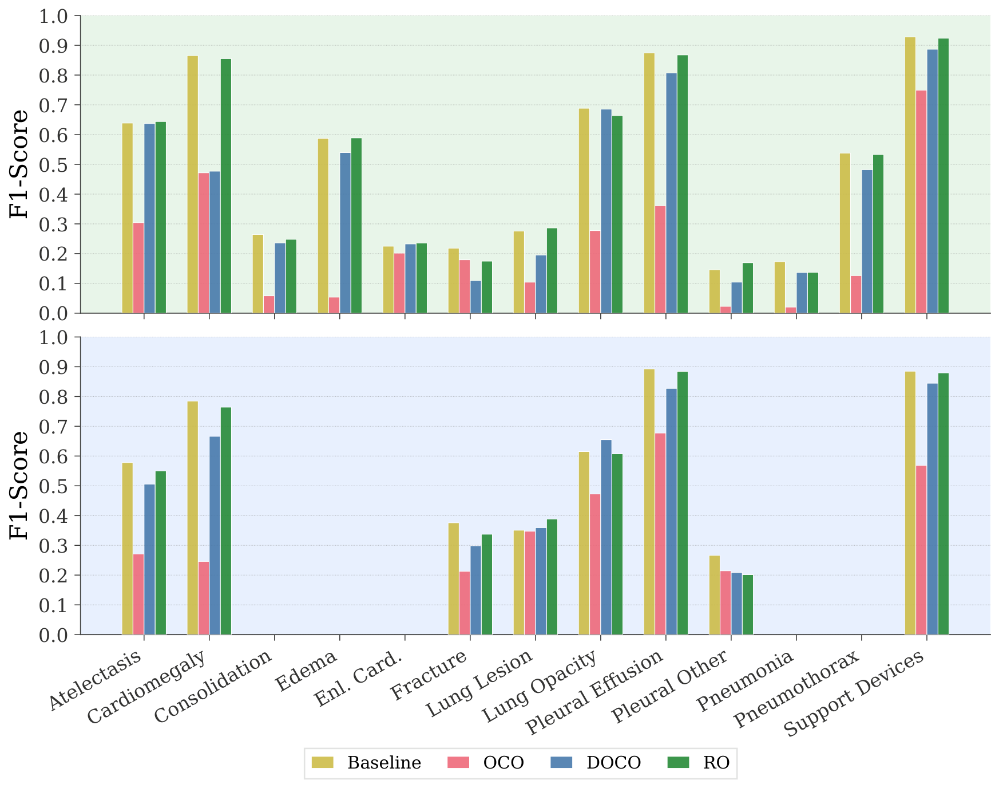

# SHOVIR

<div align="center">

<p align="center">
  
</p>

## SHOVIR: A Benchmark for Evaluating Vision Shortcut Learning in Radiology Report Generation

[](https://arxiv.org/abs/2606.30201)
[](https://arxiv.org/pdf/2606.30201)
[](https://www.python.org/)
[-6aa84f?style=for-the-badge&logo=nvidia&logoColor=white)](#environment-setup)
[](#license)

**A benchmark for evaluating whether vision-language models genuinely ground their diagnostic statements in visual evidence during chest X-ray report generation — rather than exploiting learned shortcuts that standard metrics reward but radiologists would not trust.**

**Filippo Ruffini** · Marco Salmé · Rosa Sicilia · Valerio Guarrasi · **Paolo Soda**

[📄 Paper](https://arxiv.org/abs/2606.30201) ·
[🧩 Overview](#overview) ·
[⚙️ Setup](#environment-setup) ·
[🚀 Usage](#usage) ·
[📊 Results](#results) ·
[📚 Citation](#citation)

</div>

---

<p align="center">
  
</p>

<p align="center"><em>The SHOVIR benchmark framework — disease-annotated data collection (ImageGenome, PadChest-GR), controlled occlusion experiments (baseline, full-noise, object-class, co-occurrence, and random occlusion), VLM inference over the perturbed images, and a multi-axis evaluation (NLP, clinical, and shortcut metrics).</em></p>

---

## Overview

This repository accompanies the paper *"SHOVIR: A Benchmark for Evaluating Vision Shortcut Learning in Radiology Report Generation"* ([arXiv:2606.30201](https://arxiv.org/abs/2606.30201)).

Standard radiology report generation (RRG) metrics (BLEU, ROUGE, RadGraph-F1, CheXBERT) reward textual and clinical-entity overlap with a reference report, but say nothing about *where in the image* a model looked before writing a finding. A model can produce a fluent, clinically plausible report while never actually attending to the pathology it claims to describe — a **vision shortcut**. SHOVIR isolates this failure mode by extending two chest X-ray datasets (**PadChest-GR**, **MIMIC-CXR**) with spatial disease annotations and applying targeted image perturbations that separate two shortcut behaviors:

- **Direct shortcuts** (`OCO`, Object Class Occlusion) — a finding persists in the generated report even after the visual evidence for it has been removed from the image. If occluding the target pathology's own region doesn't suppress the finding, the model wasn't looking at it.
- **Contextual shortcuts** (`DOCO`, Co-occurrence Object Class Occlusion) — detection of a finding fails after occluding *co-occurring, related* pathologies, even though the target region itself is left intact. The model was relying on correlated context rather than the region in question.
- **Random Occlusion** (`RO`) is the control condition: occluding random, disease-unrelated regions at matching strength, so that degradation under `OCO`/`DOCO` can be attributed to the *targeted* removal of evidence rather than to occlusion in general.

Across **eight state-of-the-art VLMs** (extended here to **11** in this repository) — CXRMate-ED, CheXagent, LLaVA-Rad, Libra, MAIRA-2, MedGemma, NV-Reason-CXR, RaDialog, plus Gemini and GPT-5.4 baselines — we find substantial variation in shortcut behavior across architectures and datasets, and that report fluency/quality does **not** imply strong spatial grounding: some of the highest-scoring models on standard metrics show the flattest response to occlusion, i.e. their findings are largely occlusion-invariant.

> **Dataset note.** PadChest-GR and MIMIC-CXR are governed by their own data-use agreements and are **not redistributed** with this repository. `data/`, `outputs/`, `results/`, `logs/`, and all venv directories are gitignored. The repository contains the full inference, occlusion, and evaluation pipeline, along with placeholder paths that downstream users can point at their own copy of either dataset.

---

## Repository layout

```
src/benchmark/           # Core benchmark: CLI, model registry, inference pipeline
  models/                # 11 model implementations (one file per model family)
  cli.py                 # Entry point: python -m src.benchmark.cli
  hf_runner.py           # HuggingFace inference orchestration
  config.py              # Configuration dataclass
  prompts.py             # Model-specific prompt templates
  preprocess.py          # Image preprocessing & occlusion strategies (oco/doco/roco/ro/noise)
  datasets/              # PadChest-GR / MIMIC-CXR dataset loaders
  io.py                  # I/O utilities
src/analysis/            # Dataset analysis & visualization scripts
scripts/                 # SLURM batch scripts, one subtree per experiment family
  baseline/                # Full-image, no occlusion
  oco/, doco/, ro/         # Object-class / co-occurrence / random occlusion sweeps
  all_noise_mean/          # Correlated-noise perturbation sweep
figures/                  # Paper figures (occlusion sweeps, per-pathology breakdown)
evaluations/              # Deprecated in-repo metrics — see Evaluation Metrics below
Libra/                   # Git submodule: LLaVA-based backbone for Libra & LLaVA-Rad
RaDialog-interactive-radiology-report-generation/  # Git submodule: RaDialog model
GREEN/                   # Git submodule: Stanford AIMI GREEN evaluation metric
data/                    # Dataset directory (gitignored)
outputs/                 # Inference results, JSONL per model/experiment (gitignored)
results/                 # Evaluation results, CSV/Excel (gitignored)
logs/                    # Job logs (gitignored)
```

Initialize submodules with:
```bash
git submodule update --init --recursive
```

---

## Environment Setup

Requires **Python 3.11.5**, CUDA, and a **single GPU with ≥48GB VRAM** (validated on NVIDIA **L40S** and **A40**) — no multi-GPU or cluster orchestration is needed to run any model in the registry at `bfloat16`.

Multiple virtual environments are used to avoid dependency conflicts between model families:

| Venv | Models | Requirements file |
|------|--------|--------------------|
| `.venv_RRG` | MedGemma, MAIRA-2, CXRMateED | `requirements_rrg.txt` |
| `.venv_nv` | NV-Reason-CXR, CheXOne | `requirements_reasoning.txt` |
| `.SC_Libra_venv` | Libra, LLaVA-Rad | `requirements_llava-libra.txt` |
| `.venv_chexagent` | CheXagent | `requirements_chexagent.txt` |
| `.radialog_venv` | RaDialog | `requirements_radialog.txt` |

```bash
python3.11 -m venv .venv_RRG
source .venv_RRG/bin/activate
pip install --upgrade pip
pip install -r requirements_rrg.txt
```

Gemini and GPT-5.4 are called via API and do not need a local model venv, but do need their respective API keys exported.

### Required environment variables

```bash
export HF_TOKEN="<huggingface_token>"
export HF_HOME="${PWD}/.models_cache"
export PYTHONPATH="${PWD}:${PYTHONPATH}"
```

### Batch scheduling

The `scripts/` tree ships SLURM job scripts for convenience on Slurm-managed clusters, but every model runs identically via the plain CLI on a single workstation GPU — SLURM is optional tooling for batch submission, not a requirement.

---

## Supported Models

| Model | Key | Virtual env |
|-------|-----|-------------|
| MedGemma | `medgemma` | `.venv_RRG` |
| MAIRA-2 | `maira-2` | `.venv_RRG` |
| CXRMateED | `cxrmateed` | `.venv_RRG` |
| NV-Reason-CXR | `nv-reason-cxr-3b` | `.venv_nv` |
| CheXOne | `chexone` | `.venv_nv` |
| Libra | `libra` | `.SC_Libra_venv` |
| LLaVA-Rad | `llavarad` | `.SC_Libra_venv` |
| CheXagent | `chexagent` | `.venv_chexagent` |
| RaDialog | `radialog` | `.radialog_venv` |
| Gemini | `gemini` | API |
| GPT-5.4 | `gpt54` | API |

## Experiment types

| Key | Meaning |
|-----|---------|
| `baseline` | Full image, no modification |
| `oco_pN` | Object Class Occlusion — occlude the target pathology's own region at strength `N` (`p25`/`p50`/`p75`/`p100`) → probes **direct shortcuts** |
| `doco_pN` | Co-occurrence Object Class Occlusion — occlude regions of pathologies correlated with the target, target region left intact → probes **contextual shortcuts** |
| `roco_pN` | Random Object Class Occlusion — occlude random (non-corresponding) regions at the same strength levels, as a control |
| `ro_pN` | Random Occlusion — occlude random image patches irrespective of disease regions |
| `all_noise` / `all_noise_mean` | Correlated / mean-noise injection over the full image |

---

## Usage

### Run model inference

```bash
python -m src.benchmark.cli \
    --model medgemma \
    --data-json data/padchest-gr/chexpert-by-label/verified_samples.json \
    --data "data/padchest-gr/BIMCV-Padchest-GR/PadChest_GR_images" \
    --experiment baseline \
    --output-dir outputs \
    --cache-dir .models_cache \
    --device cuda:0 \
    --dtype bfloat16 \
    --trust-remote-code \
    --num-images 100
```

Key flags:
- `--model` — model key from the registry (required)
- `--data-json` / `--data` — dataset annotation JSON and image directory (required)
- `--experiment` — experiment name, e.g. `baseline`, `oco_p50`, `doco_p50`, `roco_p75`, `ro_p50` (required)
- `--output-dir` — results directory (default: `outputs`)
- `--single-prompt-baseline` — for `--experiment baseline`, share one prompt across models (writes to `outputs/baseline_SP/`)
- `--seed` — random seed for occlusion region selection (default: `3`)

### Submit SLURM batch jobs

```bash
# Submit all models for a given experiment family / dataset
./scripts/baseline/padchest-gr/submit_all.sh
./scripts/ro/padchest-gr/submit_all.sh
./scripts/oco/padchest-gr/submit_all.sh
./scripts/doco/padchest-gr/submit_all.sh

# Or submit an individual model
sbatch scripts/baseline/padchest-gr/run_medgemma.sh
```

Output format: JSONL, one line per sample, at `outputs/<experiment>/<dataset>/<model>.jsonl`:

```json
{
  "model": "chexone",
  "model_id": "StanfordAIMI/CheXOne",
  "prompt": "Analyze this chest X-ray...",
  "image_path": "data/padchest-gr/.../image.png",
  "generated_text": "The chest X-ray shows...",
  "metadata": {}
}
```

---

## Evaluation Metrics

Report-generation metrics (BLEU, ROUGE, BERTScore, F1-RadGraph, CheXbert F1, GREEN) are computed with **[radscore](https://github.com/fruffini/radscore)**, a standalone package maintained alongside this project. It replaces the metric code that used to live in `evaluations/` in this repository — that directory is kept only as a pointer to `radscore` and is no longer part of the pipeline.

### Install

```bash
git clone --recurse-submodules https://github.com/fruffini/radscore.git
cd radscore
python3.11 -m venv radscore-env
source radscore-env/bin/activate
python -m pip install -U pip
python -m pip install -e .

# Optional: GREEN metric (LLM-based clinical error grading)
git submodule update --init --recursive
python -m pip install -e third_party/GREEN --ignore-requires-python
```

### Run

```bash
# Default scorers, one score per file
radscore --filepath outputs/baseline/padchest-gr/medgemma.jsonl --output-mode per-file

# Pick specific scorers and get bootstrap confidence intervals
radscore --filepath outputs/baseline/padchest-gr/medgemma.jsonl \
         --scorers CheXbert,F1-RadGraph,ROUGE-L \
         --bootstrap-ci \
         --output-mode per-experiment

# Include GREEN
radscore --filepath outputs/baseline/padchest-gr/medgemma.jsonl --compute-green
```

`radscore` expects a JSON list with `prediction` / `reference` fields (plus an optional 14-element CheXbert `label` vector and `target_category` for per-category breakdowns — see the [radscore README](https://github.com/fruffini/radscore) for the exact schema and the Python API).

---

## Results

Full sweeps across `RO`, `OCO`, and `DOCO` at perturbation strengths `p ∈ {0, 20, 40, 60, 80, 100}%`, on both PadChest-GR and MIMIC-CXR, are reported in the paper. This section summarizes the headline figures and tables shipped in `figures/`.

### Baseline vs. Full Noise Image (image-level evaluation)

<p align="center">
  
</p>

CheXagent-2 shows the largest ΔFN on both datasets — the most visually grounded model when the entire image is replaced with noise — while LLaVA-Rad (MIMIC-CXR) and RaDialog (PadChest-GR) show the smallest, i.e. their scores barely move even with zero visual evidence left.

### Direct vs. contextual shortcuts

Micro-F1 vs. perturbation ratio for `RO`, `OCO`, and `DOCO`, across 8 models on MIMIC-CXR (top) and PadChest-GR (bottom). `RO` curves stay essentially flat for every model, as expected for a control that removes disease-unrelated evidence. `OCO` produces the steepest drops overall — e.g. on MIMIC-CXR most models fall from ~0.72–0.76 at `p=0` to ~0.28–0.42 at `p=100` — showing that report quality *is* substantially tied to the target region once it's actually removed. `DOCO` sits between the two, confirming that co-occurrence context contributes but matters less than the direct region. Model ranking is architecture-dependent: e.g. CXRMate is consistently the strongest and most stable model on PadChest-GR across all three conditions, while MAIRA-2 has the lowest baseline but a comparatively shallower relative decline under `OCO`.

<p align="center">
  
</p>

### Per-pathology breakdown

F1-score per disease category, averaged across all evaluated models, comparing `Baseline`, `OCO`, `DOCO`, and `RO` at `p=100%` on MIMIC-CXR (top) and PadChest-GR (bottom). `OCO` is the only condition that meaningfully suppresses detection for most pathologies (e.g. Pleural Effusion drops from ~0.87 to ~0.36 on MIMIC-CXR baseline→OCO), while `DOCO` and `RO` track much closer to the unperturbed baseline — consistent with the direct-shortcut/contextual-shortcut distinction holding at the per-disease level, not just in aggregate.

<p align="center">
  
</p>

---

## Troubleshooting

| Issue | Fix |
|-------|-----|
| CUDA out of memory | Lower `--num-images`, keep `--dtype bfloat16`; every model in the registry fits in 48GB VRAM at this precision |
| Import errors | Confirm the correct venv is active and matches the model family table above |
| Model download fails | Set `HF_TOKEN`, check connectivity, verify `.models_cache` permissions |
| Submodule not found | `git submodule update --init --recursive`; check with `git submodule status` |

---

## Data availability

PadChest-GR and MIMIC-CXR are subject to their own data-use agreements (PhysioNet credentialed access for MIMIC-CXR) and are **not distributed** with this repository. This release contains the full inference, occlusion, and evaluation pipeline, along with placeholder paths that can be pointed at a local copy of either dataset once access has been obtained.

---

## Citation

If you use this benchmark, please cite:

```bibtex
@article{ruffini2026shovir,
  title   = {SHOVIR: A Benchmark for Evaluating Vision Shortcut Learning in Radiology Report Generation},
  author  = {Ruffini, Filippo and Salm{\'e}, Marco and Sicilia, Rosa and Guarrasi, Valerio and Soda, Paolo},
  journal = {arXiv preprint arXiv:2606.30201},
  year    = {2026},
  url     = {https://arxiv.org/abs/2606.30201}
}
```

---

## License

All source code, configurations, documentation, and figures in this repository are released under the **Creative Commons Attribution-NonCommercial 4.0 International License (CC BY-NC 4.0)** — see [`LICENSE`](LICENSE) for the summary and [creativecommons.org/licenses/by-nc/4.0](https://creativecommons.org/licenses/by-nc/4.0/) for the full legal text.

In short:

- ✅ **Allowed** — academic research, teaching, non-profit clinical research, personal study, modification and redistribution **with attribution** to the authors and a link to the original paper ([arXiv:2606.30201](https://arxiv.org/abs/2606.30201)).
- ❌ **Not allowed without a separate licence** — incorporation into a commercial product or paid service, use within a for-profit clinical decision-support system, paid consulting whose deliverable is derived from this code, or any other commercial exploitation.

For **commercial licensing** please contact the corresponding authors.

## Contact

Filippo Ruffini — filippo.ruffini@unicampus.it
